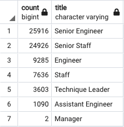
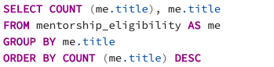
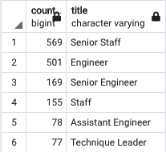

# Employee_DB_Challenge

##
Purpose

###
The purpose of this analysis is to create additional tables in order to determine the number of retiring employees by title and to identify employees
who are eligible to participate in a mentorship program. 

##
Results

###
Pewlett Hackard (PH) provided six csv files, each file containing different employee information such as employee number, first and last name, title,
salary and hire date. The files were used to build an employee database and run various queries to analyze the data. Following is a summary of the six
tables created and related information included within each file. 

####
•	departments: contains department number and department name

•	dept_emp: contains employee number, department number, employment from and to dates

•	dept_manager: contains department number, employee number, from and to dates

•	employees: contains employee number, birth date, first name, last name, hire date, and gender

•	salaries: employee number, salary, from and to dates

•	titles: employee number, title, from and to dates

###
Below is a summary of supplemental tables created to address management’s additional requests regarding upcoming retirement eligibility.  

•	Employee Titles Table: For employees born between January 1, 1952 and December 31, 1955, a table was created to associate the job title to the
employee. This was done by joining the previously created employees and titles tables based on employee number and filtering (i.e. WHERE) by birth date
between January 1, 1952 and December 31, 1955. The table returned a total of 133,776 employees. The result contained multiple entries for employees that
held different titles throughout their career at PH. As such, the table was further filtered to obtain the most recent position held by the employee.

•	Unique Titles Table: This table was created to remove duplicate entries for employees that held different titles throughout their career at PH. The
function DISTINCT ON along with function ORDER BY were used to remove multiple titles per employee and return the most recent title held.  An additional
filter was used to only include current employees using the WHERE function and setting the employment ‘to date’ equal to “9999-01-01”. The results show
that 72,458 employees are retirement eligible. 

•	Retiring Titles Table: This table was created to group retirement eligible employees by title by using the
function SELECT COUNT and ORDER BY COUNT. The results show that retirement eligible employees hold 7 different 
titles: Senior Engineer, Senior Staff, Engineer, Staff, Technique Leader, Assistant Engineer and Manager. The 
majority of retirement eligible employees hold Senior Engineer or Senior Staff title. 

•	Mentorship Eligibility Table: This table shows currently employed employees born between January 1, 1965 and 
December 31, 1965. The table was created by joining the previously created employees and department employees’
tables on employees number and filtering (i.e. WHERE) by employment ‘to date’ equal to “9999-01-01” and birth date
between January 1, 1965 and December 31, 1965. The results show that there are currently 1,549 employees that fit
the criteria for mentorship. 

##
Summary

###
As part of the “silver tsunami”, there are 72,458 jobs that will need to be filled. This figure is based on results
from the Retiring Titles table, which filters based on birth year falling between 1952 and 1955. To further assist
with assessing the impact of this, a table was created to group retirement eligible employees based on birth year.
A query was ran to extract the birth year from the birth date column from the employees table and then right join with
Unique Titles table. 

	

The results show that the number employees are evenly split based on birth year.  

There are currently 1,549 retirement eligible employees that qualify for mentorship based on results from the 
Mentorship Eligibility table, which filters based on birth year falling in 1965. To assist in determining if there 
are sufficient qualified, retirement-ready employees, an additional query was created to group the employees based on title.
This query can then be used to assess whether the number of employees holding each title is inline with the rest of the company. 
Below is the new query:

The results show that the majority of retirement-ready employees hold either a Senior Staff or Engineer title. 

